# Arquitetura GCP

## Objetivo

A primeira arquitetura cloud privilegia serviços gerenciados, escala a zero onde aplicável e baixo
custo operacional. Ela preserva o desenho assíncrono validado localmente, sem Kubernetes ou VMs
permanentes.

## Visão geral

```mermaid
flowchart LR
    Client[Cliente] -->|HTTPS multipart/JSON| API[Cloud Run Service<br/>photo-api]
    API -->|JDBC via Cloud SQL Connector| SQL[(Cloud SQL<br/>MySQL 8.4)]
    API -->|objeto original| Original[(Cloud Storage<br/>bucket original)]
    Original -->|object finalized| Eventarc[Eventarc]
    Eventarc --> Processor[Cloud Run Function<br/>photo-processor]
    Processor -->|objeto processado| Processed[(Cloud Storage<br/>bucket processado)]
    Processor -->|referências e metadados| Topic[Pub/Sub<br/>foto-processada]
    Topic --> MainSub[Push subscription<br/>photo-consumer-sub]
    MainSub -->|Push autenticado| Consumer[Cloud Run Service privado<br/>photo-consumer]
    MainSub -. tentativas esgotadas .-> DLT[Dead Letter Topic]
    DLT --> DLTSub[Push subscription DLT]
    DLTSub -->|Push autenticado| Consumer
    Consumer -->|download temporário| Processed
    Consumer -->|BLOB, metadados e estado| SQL
```

Pub/Sub transporta somente IDs, referências e metadados. Os bytes percorrem Storage e, no passo
final, são persistidos como BLOB no MySQL.

## Componentes

### photo-api

Aplicação Spring Boot 4 em Java 25, empacotada como container e executada em Cloud Run Service.
Ela permanece pública neste projeto de estudo e pode escalar a zero.

Responsabilidades:

- validar nome, cardinalidade, formato e limite de 10 MiB;
- persistir usuário e processamento;
- gravar a imagem original no bucket original;
- consultar usuários, processamentos e foto atual;
- executar substituição de foto e exclusão retomável;
- executar Flyway no startup;
- acessar Cloud SQL e os dois buckets conforme as operações de exclusão.

O número máximo de instâncias, a concorrência por instância e o pool JDBC devem ser definidos em
conjunto para proteger o limite de conexões do Cloud SQL.

### photo-processor

Função Java 25 baseada em Functions Framework. Eventarc entrega um CloudEvent quando um objeto é
finalizado no bucket original.

Responsabilidades:

- validar bucket, chave, geração, `usuarioId` e `processamentoId`;
- baixar a geração correta da original;
- corrigir orientação, limitar a 1024x1024 e preservar proporção/alpha;
- proteger contra imagens-bomba pelo limite de pixels;
- gravar com create-only no bucket processado;
- reutilizar resultado determinístico em reexecuções;
- publicar `PhotoProcessingResult` ou `PhotoProcessingError` no Pub/Sub.

A função não acessa MySQL, não usa Spring Boot, Actuator ou Circuit Breaker.

### photo-consumer

Aplicação Spring Boot 4 em Java 25, empacotada como container e executada em Cloud Run Service
privado. Na GCP, duas subscriptions Push autenticadas chamam endpoints HTTPS autenticados e não
públicos: fluxo principal e DLT. O serviço não usa rede privada nesta fase; IAM bloqueia invocação
não autenticada e Pub/Sub apresenta token OIDC de `sa-pubsub-push`.

Responsabilidades preservadas:

- validar contrato e schema do evento;
- tratar duplicatas, redelivery e mensagens atrasadas ou fora de ordem;
- baixar a processada fora de transação longa;
- persistir BLOB e metadados;
- promover a foto atual e concluir `PERSISTIDA` no mesmo commit;
- retomar `PERSISTINDO` idempotentemente;
- registrar `ERRO_PROCESSAMENTO` e `ERRO_PERSISTENCIA` quando permitido;
- tratar mensagens da DLT sem criar uma segunda DLT.

O protocolo Push reconhece como ACK somente os códigos de resposta suportados pelo Pub/Sub. Como
convenção deste projeto, o consumer retorna **HTTP 204 No Content** apenas depois de commit ou no-op
válido e rastreável. Resposta que não corresponda a ACK, inclusive a usada para mensagem inválida que
deva seguir tentativas/DLT, ou timeout provoca redelivery. A idempotência continua obrigatória porque
Push/Eventarc operam com semântica de pelo menos uma vez.

## Fluxo de cadastro e processamento

1. Cliente envia nome e uma foto ao `photo-api`.
2. API valida o multipart, cria usuário/processamento e salva a original com chave determinística.
3. A resposta HTTP informa `PROCESSANDO` somente após confirmação do objeto original.
4. Cloud Storage emite `object finalized`; Eventarc invoca o processor.
5. Processor transforma e grava a imagem processada.
6. Processor publica apenas referência e metadados no tópico.
7. Pub/Sub envia o envelope Push ao consumer autenticado.
8. Consumer baixa o objeto, persiste BLOB/metadados e promove a foto atual em transação.
9. A consulta do processamento passa a retornar `PERSISTIDA` e a foto fica disponível pela API.

## Falhas e entrega

- Google clients mantêm deadlines e micro-retries finitos para falhas transitórias.
- Pub/Sub mantém macro-redelivery finita e encaminhamento para DLT.
- O processor pode ser reexecutado pelo mesmo `processamentoId` sem reprocessar um resultado válido.
- O consumer usa locks, CAS, estado e `sequencia_upload` para não duplicar BLOB nem promover foto
  antiga.
- Estados terminais não regridem.
- Não existe reconciliador automático. Um processamento que permaneça ativo após o esgotamento dos
  mecanismos normais exige tratamento operacional e continua bloqueando upload/exclusão daquele
  usuário.

## Persistência

### Cloud SQL

- MySQL 8.4;
- single-zone;
- sem HA e réplicas;
- backups desabilitados por decisão de custo deste ambiente de estudo;
- configuração inicial pequena;
- Flyway executado pelo `photo-api` durante startup;
- `photo-consumer` apenas valida o schema pelo JPA e não executa migrations.

Sem backups, exclusão ou corrupção do banco pode ser irrecuperável. Essa escolha não representa uma
configuração recomendada para produção real.

### Cloud Storage

- bucket original e bucket processado separados;
- somente o original gera evento Eventarc;
- sem object versioning;
- lifecycle `Delete` com idade de 3 dias nos dois buckets;
- objetos podem ser removidos pelo lifecycle de forma assíncrona após se tornarem elegíveis;
- a foto atual continua disponível porque seus bytes foram persistidos no MySQL.

A exclusão da aplicação já trata objeto ausente como sucesso idempotente, portanto é compatível com
objetos previamente removidos pelo lifecycle. Original e processada são temporárias: se retry, DLT
ou tratamento operacional ocorrer depois da remoção da processada, o consumer pode não conseguir
baixá-la para persistir o BLOB. Essa limitação é aceita neste ambiente de estudo e pode exigir novo
upload ou intervenção manual.

## Ambiente local versus GCP

| Responsabilidade | Local | GCP |
|---|---|---|
| API | container Docker, porta 8080 | Cloud Run Service público |
| Consumer | container + Pub/Sub Push do emulator | Cloud Run privado + Pub/Sub Push autenticado |
| Processor | Functions Framework, porta 8082 | Cloud Run Function |
| Banco | MySQL 8.4 no Compose | Cloud SQL for MySQL 8.4 |
| Objetos | fake-gcs-server | Cloud Storage |
| Evento de objeto | `storage-event-dispatcher` | Eventarc |
| Mensageria | Pub/Sub Emulator | Pub/Sub e DLT gerenciados |
| Credenciais | configuração local/emulator | Service identity/ADC e Secret Manager |
| Imagens de container | build local | Artifact Registry |
| Logs/métricas | stdout e Actuator | Cloud Logging e Cloud Monitoring |

O `storage-event-dispatcher` é exclusivo do ambiente local e não será implantado.

## Lacunas atuais antes do deployment

- O consumer já possui adapters HTTP para os envelopes Push principal e DLT e usa HTTP 204 como
  confirmação explícita; autenticação OIDC/IAM será configurada na infraestrutura GCP.
- A porta do consumer respeita `PORT` fornecida pelo Cloud Run e mantém 8081 como padrão local.
- Os três componentes usam endpoint local do Storage como default; na GCP devem usar endpoint
  padrão, ADC e as service accounts de runtime.
- API e consumer usam JDBC convencional; ainda falta a configuração do Cloud SQL Connector.
- Nomes de buckets, projeto, tópico, subscriptions e secrets ainda precisam de configuração cloud.
- Os Dockerfiles atuais foram criados para o ambiente local; precisam ser revisados para imagens
  finais do Cloud Run. A função pode usar o build gerenciado de Cloud Run functions.

## Referências oficiais

- [Pub/Sub autenticado com Cloud Run](https://docs.cloud.google.com/run/docs/tutorials/pubsub)
- [Service identity no Cloud Run](https://docs.cloud.google.com/run/docs/securing/service-identity)
- [Object Lifecycle Management](https://docs.cloud.google.com/storage/docs/lifecycle)
