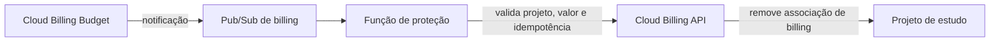

# Observabilidade e proteção de custo

## Observabilidade inicial

A primeira versão usa somente Cloud Logging e Cloud Monitoring. Não serão implantados Prometheus,
Grafana ou outra plataforma.

Os componentes escrevem logs estruturados em stdout. Sempre que aplicável, a trilha deve conter:

- `service` e `event`;
- `usuarioId` e `processamentoId`;
- estado do processamento;
- `eventId`, Pub/Sub message ID e delivery attempt;
- bucket, objeto e geração;
- tentativa de retry, timeout e estado do Circuit Breaker;
- DLT, categoria e código do erro.

Nunca registrar bytes de imagem, credenciais, tokens ou secrets.

## Dashboard planejado

### Cloud Run

- requests e requests por minuto;
- latência p50, p95 e p99;
- respostas 2xx, 4xx e 5xx;
- instâncias ativas;
- CPU e memória;
- concorrência e pending requests;
- cold starts quando o sinal estiver disponível.

### Cloud SQL

- CPU e memória/pressão quando expostas;
- conexões usadas versus limite;
- armazenamento;
- erros e latência de conexão;
- reinícios ou indisponibilidade.

### Pub/Sub e Eventarc

- backlog e idade da mensagem mais antiga;
- taxa de entrega e delivery attempts;
- respostas Push com erro;
- mensagens encaminhadas para DLT;
- invocações e falhas do processor.

### Aplicação

- uploads aceitos/rejeitados;
- tempo até `PERSISTIDA`;
- `ERRO_PROCESSAMENTO` e `ERRO_PERSISTENCIA`;
- reutilização idempotente pelo processor;
- retomada de `PERSISTINDO`;
- ACK/no-op de duplicatas e eventos antigos.

## Alertas iniciais

- crescimento ou idade elevada do backlog;
- qualquer mensagem na DLT;
- aumento sustentado de 5xx;
- Cloud SQL próximo do limite de conexões ou armazenamento;
- falhas consecutivas da função;
- ausência inesperada de processamento concluído em conjunto com backlog;
- consumo de budget nos percentuais definidos.

Dashboard e alert policies de métricas da aplicação serão modelados somente depois do primeiro
deployment funcional. Os sinais nativos e logs estruturados serão usados para obter baseline antes
de definir thresholds de CPU, memória, 5xx, latência, backlog ou Cloud SQL.

Sem reconciliador, detecção e tratamento de processamentos ativos não recuperados são
operacionais. Uma consulta/log baseado em idade pode auxiliar o diagnóstico, mas não deve alterar o
estado automaticamente.

## Estratégia de custo

### Recursos que escalam com uso

- Cloud Run da API e consumer com `min-instances=0`;
- Cloud Run Function;
- Pub/Sub e Eventarc;
- Cloud Storage;
- Artifact Registry;
- Logging e Monitoring.

Configurar retenção e lifecycle, excluir imagens antigas do Artifact Registry e evitar log por
polling/retry em excesso.

### Custo contínuo principal

Cloud SQL permanece provisionado sem tráfego e é o principal risco de custo fixo. A instância será
pequena, single-zone, sem HA, réplicas ou backups. Antes do provisionamento, validar preços atuais,
armazenamento mínimo e compatibilidade do tier com MySQL 8.4 em `us-central1`.

Valores, quotas e Free Tier mudam. Todos os números devem ser confirmados na documentação e na
calculadora da GCP imediatamente antes do apply.

## Budget inicial

O budget tradicional fica em um root Terraform separado, com state em `billing/state`, e deve ser
criado antes do primeiro provisionamento do Cloud SQL. Ele acompanha o gasto bruto mensal do projeto
(`EXCLUDE_ALL_CREDITS`) e notifica os destinatários IAM padrão em 50%, 80%, 90% e 100%.

Budget é alerta, não hard cap: contabilização e notificações podem atrasar e não interrompem recursos.
O valor é fornecido operacionalmente e nunca hardcoded no repositório.

Spend Cap Budget permanece fora desta fase. O recurso está em Preview, limita-se a serviços
elegíveis e não cobre Cloud SQL atualmente; portanto não protege a principal exposição contínua de
custo deste projeto.

## Desligamento de emergência futuro

Fluxo apenas estudado, ainda não implementado:

O valor de referência estudado é aproximadamente US$ 225, preservando margem frente aos créditos
promocionais. Ele não deve ser codificado antes de confirmar créditos, moeda, budget scope e atraso
de contabilização.

### Salvaguardas obrigatórias para a futura automação

- inicialmente operar em modo dry-run e emitir alerta;
- aceitar somente mensagens do budget/projeto esperados;
- ser idempotente;
- registrar decisão e valor observado sem expor secrets;
- usar service account dedicada com permissão mínima;
- exigir opt-in explícito para habilitar o desligamento;
- manter runbook de reativação e recuperação;
- combinar com alertas antecipados abaixo do limite de desligamento.

Budget não é um hard cap. Há atraso entre consumo, contabilização e notificação, portanto custos
podem ultrapassar o limite. Desabilitar billing encerra serviços, inclusive Free Tier, e alguns
recursos podem ser removidos ou não se recuperar automaticamente. Backups estão desabilitados neste
ambiente, ampliando o risco de perda do banco ao usar esse mecanismo.

## Referências oficiais

- [Budgets e notificações programáticas](https://docs.cloud.google.com/billing/docs/how-to/budgets)
- [Desabilitar billing por notificações](https://docs.cloud.google.com/billing/docs/how-to/disable-billing-with-notifications)
- [Impacto de desabilitar billing](https://docs.cloud.google.com/billing/docs/how-to/modify-project)
